Below is an architectural visualization of the "Teammate" system using a directed graph (digraph) in the DOT language, similar to your example. This graph represents the full system, including the central intelligence (Teammate) and all sub-agents, along with their interactions and data flow. It’s designed to reflect the multi-agent architecture, Microsoft Teams integration, and the flow of commands and responses. I'll adapt the structure to fit Teammate’s functionality, ensuring a clear top-to-bottom (TB) flow with subgraphs where appropriate.

---

### Architectural Visualization (DOT Graph)

```dot
digraph TeammateSystemFlow {
    rankdir=TB;
    node [shape=box, style=filled, fillcolor=lightgray];
    edge [fontsize=10];

    // Central entry point: Teams Interface
    TeamsInterface [label="Teams Interface (Bot Framework)", fillcolor=lightblue];

    // Central Intelligence: Teammate
    Teammate [label="Teammate (Central Intelligence)", fillcolor=lightgreen];

    // Sub-Agents
    Scheduler [label="Scheduler"];
    NoteTaker [label="Note-Taker"];
    Presenter [label="Presenter"];
    Communicator [label="Communicator"];
    DocumentReader [label="Document-Reader"];
    Suggestor [label="Suggestor"];

    // External Systems and Outputs
    Database [label="PostgreSQL Database", fillcolor=lightyellow];
    SpeechService [label="Azure Speech Service", fillcolor=lightyellow];
    GraphAPI [label="Microsoft Graph API", fillcolor=lightyellow];
    LLM [label="GPT-like LLM", fillcolor=lightyellow];
    Output [label="Output (Text/Voice/Slides)", fillcolor=lightpink];

    // Flow from Teams to Teammate
    TeamsInterface -> Teammate [label="Command (e.g., 'Teammate, schedule')"];

    // Teammate delegates to Sub-Agents
    Teammate -> Scheduler [label="Schedule meeting/reminders"];
    Teammate -> NoteTaker [label="Take notes"];
    Teammate -> Presenter [label="Present slides"];
    Teammate -> Communicator [label="Send message/call"];
    Teammate -> DocumentReader [label="Read document"];
    Teammate -> Suggestor [label="Make suggestion"];

    // Sub-Agent Interactions with External Systems
    Scheduler -> GraphAPI [label="Create event"];
    Scheduler -> Communicator [label="Trigger reminders"];
    NoteTaker -> SpeechService [label="Speech-to-text + diarization"];
    NoteTaker -> Database [label="Store minutes"];
    Presenter -> GraphAPI [label="Share slides"];
    Presenter -> SpeechService [label="Text-to-speech"];
    Communicator -> GraphAPI [label="Send message/call"];
    DocumentReader -> Database [label="Fetch document"];
    DocumentReader -> SpeechService [label="Transcribe audio/video"];
    Suggestor -> LLM [label="Generate suggestion"];
    Suggestor -> Database [label="Fetch context"];

    // Feedback Loops and Outputs
    Scheduler -> Output [label="Confirmation"];
    NoteTaker -> Output [label="Minutes file path"];
    Presenter -> TeamsInterface [label="Ask 'Can you see?'"];
    Presenter -> Output [label="Slide content"];
    Communicator -> Output [label="Message/call sent"];
    DocumentReader -> Output [label="Answer to query"];
    Suggestor -> Output [label="Suggestion"];

    // TeamsInterface receives outputs
    Output -> TeamsInterface [label="Return to team"];

    // Subgraph for Sub-Agents (grouped for clarity)
    subgraph clusterSubAgents {
        rank=same;
        label="Sub-Agents (LangGraph Nodes)";
        style=dashed;
        Scheduler;
        NoteTaker;
        Presenter;
        Communicator;
        DocumentReader;
        Suggestor;
    }

    // Subgraph for External Systems
    subgraph clusterExternal {
        rank=same;
        label="External Systems";
        style=dashed;
        Database;
        SpeechService;
        GraphAPI;
        LLM;
    }
}
```


---

### Explanation of the Graph
1. **TeamsInterface (Top Level)**:
   - Represents the Microsoft Teams bot interface where users interact with Teammate via text or voice commands.
   - Entry point for all interactions.

2. **Teammate (Central Intelligence)**:
   - Acts as the orchestrator, built with LangGraph, receiving commands from Teams and routing them to the appropriate sub-agent.
   - Highlighted in green to signify its central role.

3. **Sub-Agents (Cluster)**:
   - Six sub-agents (Scheduler, Note-Taker, Presenter, Communicator, Document-Reader, Suggestor) are grouped in a dashed cluster to show they operate as modular nodes under Teammate’s control.
   - Each sub-agent has specific responsibilities and interactions with external systems.

4. **External Systems (Cluster)**:
   - Includes PostgreSQL (Database), Azure Speech Service, Microsoft Graph API, and the GPT-like LLM.
   - Grouped to indicate dependencies shared across sub-agents.

5. **Data Flow**:
   - **Command Flow**: TeamsInterface → Teammate → Sub-Agents.
   - **Processing Flow**: Sub-Agents interact with external systems (e.g., GraphAPI for scheduling, SpeechService for voice).
   - **Output Flow**: Sub-Agents → Output → TeamsInterface, delivering results back to users.
   - **Feedback Loop**: Presenter checks visibility with TeamsInterface and adjusts sharing accordingly.

6. **Output Node**:
   - Represents the final delivery mechanism (text messages, voice responses, slide displays), highlighted in pink for visibility.

---

### Visualization Notes
- **Rank Direction (TB)**: Top-to-bottom flow reflects the natural progression from user input to system output.
- **Colors**: Used to differentiate layers (blue for Teams, green for Teammate, yellow for external systems, pink for output).
- **Subgraphs**: Cluster sub-agents and external systems for clarity and to emphasize modularity.
- **Labels**: Edges are labeled with specific actions (e.g., "Send message/call") to show the purpose of each connection.

---

### How to Visualize
To see this graph visually:
1. **Online Tool**: Copy the DOT code into a tool like [GraphvizOnline](https://dreampuf.github.io/GraphvizOnline/) or [Edotor](https://edotor.net/).
2. **Local Tool**: Install Graphviz (`pip install graphviz` or via system package manager) and render it with:
   ```bash
   dot -Tpng teammate_system.dot -o teammate_system.png
   ```
   (Save the DOT code in a file named `teammate_system.dot`.)

---

### Alignment with Teammate’s README
This graph mirrors the README’s architecture:
- **Teams Integration**: Handled by TeamsInterface and GraphAPI.
- **Sub-Agents**: All six are represented with their specific roles.
- **Document Reading**: DocumentReader connects to various processing tools via Database and SpeechService.
- **Suggestions**: Suggestor uses LLM for reasoning.
- **Presentation**: Presenter includes the screen-sharing verification loop.
- **Reminders**: Scheduler triggers Communicator for calls/texts.
